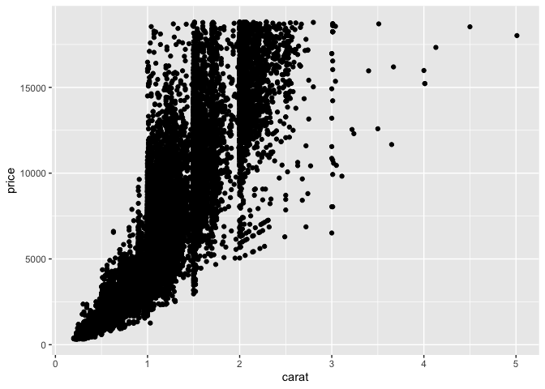

Getting Started: Diamonds
================
Hannah Sarver
2020-07-09

  - [Data Exploration](#data-exploration)

In this challenge, you will go through the process of exploring,
documenting, and sharing an analysis of a dataset. We will use these
skills again and again in each challenge.

``` r
library(tidyverse)
```

    ## ── Attaching packages ─────────────────────────────────────── tidyverse 1.3.0 ──

    ## ✓ ggplot2 3.3.2     ✓ purrr   0.3.4
    ## ✓ tibble  3.0.1     ✓ dplyr   1.0.0
    ## ✓ tidyr   1.1.0     ✓ stringr 1.4.0
    ## ✓ readr   1.3.1     ✓ forcats 0.5.0

    ## ── Conflicts ────────────────────────────────────────── tidyverse_conflicts() ──
    ## x dplyr::filter() masks stats::filter()
    ## x dplyr::lag()    masks stats::lag()

# Data Exploration

<!-- -------------------------------------------------- -->

In this first stage, you will explore the `diamonds` dataset and
document your observations.

**q1** Create a plot of `price` vs `carat` of the `diamonds` dataset
below. Document your observations from the visual.

``` r
ggplot(diamonds) +
  geom_point(mapping = aes(x = carat, y = price))
```

<!-- -->

**Observations**:

  - There is an apparent trend of covariance that as carat increases,
    price increases, but with a widening spread of price for carat
    values at 1 or higher.
  - There are large numbers of data points on the whole and half number
    values of carat, perhaps suggesting that some of the source of the
    data was biased towards some discrete values.
  - There are several outliers in the carat axis but what appears to be
    a very flat maximum value in price, even among the far outliers in
    carat.

**q2** Create a visualization showing variables `carat`, `price`, and
`cut` simultaneously. Experiment with which variable you assign to which
aesthetic (`x`, `y`, etc.) to find an effective visual.

``` r
ggplot(diamonds) +
  geom_smooth(data = subset(diamonds, carat < 2.5), mapping = aes(x = carat, y = price, color = cut)) +
  geom_point(data = subset(diamonds, carat >= 2.5), mapping = aes(x = carat, y = price, color = cut))
```

    ## `geom_smooth()` using method = 'gam' and formula 'y ~ s(x, bs = "cs")'

<!-- -->

**Observations**:

  - Using smooth gives a clearer sense of the relationship between cuts
    at lower carat values, but becomes hard to reason about or even
    misleading above carats of about 2.5 as we have much less data so
    trends are not so meaningful. Leaving data with carat of 2.5 or
    higher as a scatter plot shows few points with a lot of variation.
  - In general, worse cuts have lower prices for the same carat, with
    Fair cuts showing a greater difference in price from the other cuts.
  - One observation from the higher-carat data left as scatter points in
    this graph is that the three very highest carat values are all Fair
    cut. Perhaps the value of such high carat diamonds is deemed too
    high to waste any by cutting (we could also look at size as a factor
    here, or just look up specific information about the few diamonds in
    question).
  - There is a leveling off or downturn in the trend of price as carat
    increases past about 2.0. This appears across all cuts, but may also
    be affected by wider variation in the smaller total number of
    samples as carat increases. This also seems consistent with the
    apparent flat maximum price we observed in the first visualization.
