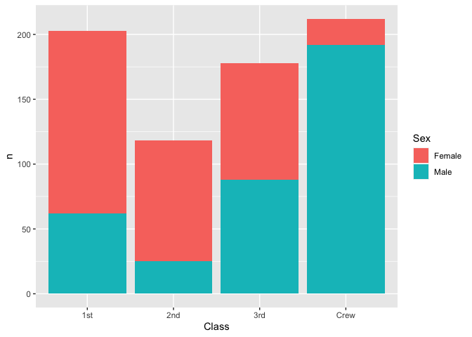
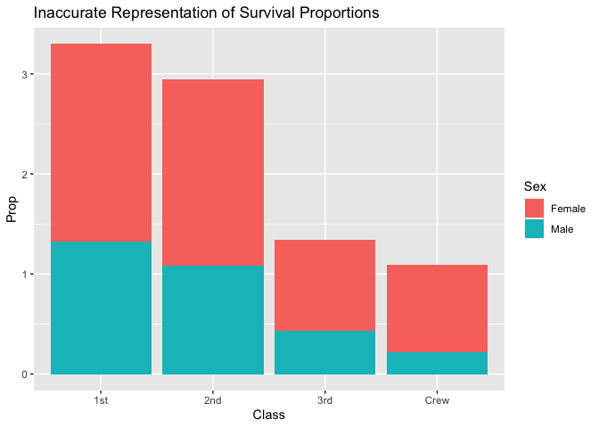
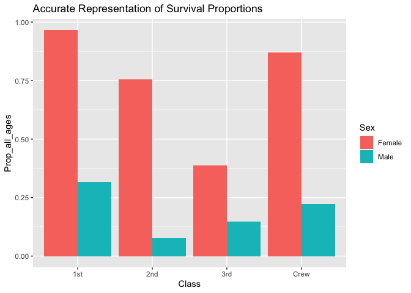
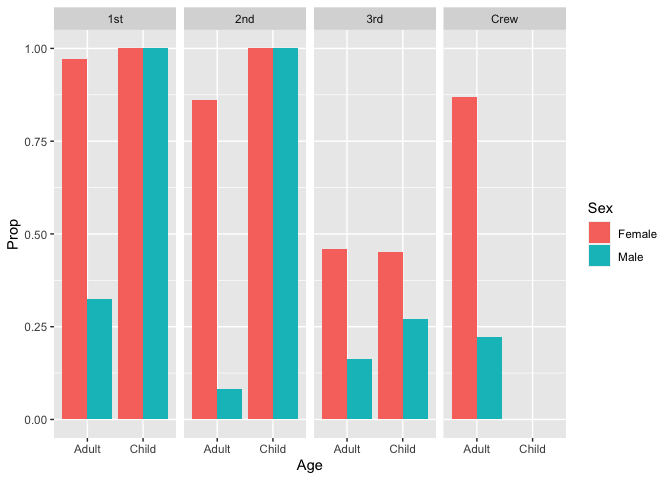

RMS Titanic
================
Hannah Sarver
2020-07-14

  - [First Look](#first-look)
  - [Deeper Look](#deeper-look)
  - [Notes](#notes)

*Purpose*: Most datasets have at least a few variables. Part of our task
in analyzing a dataset is to understand trends as they vary across these
different variables. Unless we’re careful and thorough, we can easily
miss these patterns. In this challenge you’ll analyze a dataset with a
small number of categorical variables and try to find differences among
the groups.

*Reading*: (Optional) [Wikipedia
article](https://en.wikipedia.org/wiki/RMS_Titanic) on the RMS Titanic.

``` r
library(tidyverse)
```

    ## ── Attaching packages ───────────────────────────────────────── tidyverse 1.3.0 ──

    ## ✓ ggplot2 3.3.2     ✓ purrr   0.3.4
    ## ✓ tibble  3.0.1     ✓ dplyr   1.0.0
    ## ✓ tidyr   1.1.0     ✓ stringr 1.4.0
    ## ✓ readr   1.3.1     ✓ forcats 0.5.0

    ## ── Conflicts ──────────────────────────────────────────── tidyverse_conflicts() ──
    ## x dplyr::filter() masks stats::filter()
    ## x dplyr::lag()    masks stats::lag()

``` r
df_titanic <- as_tibble(Titanic)
```

*Background*: The RMS Titanic sank on its maiden voyage in 1912; about
67% of its passengers died.

# First Look

<!-- -------------------------------------------------- -->

**q1** Perform a glimpse of `df_titanic`. What variables are in this
dataset?

``` r
## TASK: Perform a `glimpse` of df_titanic
glimpse(df_titanic)
```

    ## Rows: 32
    ## Columns: 5
    ## $ Class    <chr> "1st", "2nd", "3rd", "Crew", "1st", "2nd", "3rd", "Crew", "1…
    ## $ Sex      <chr> "Male", "Male", "Male", "Male", "Female", "Female", "Female"…
    ## $ Age      <chr> "Child", "Child", "Child", "Child", "Child", "Child", "Child…
    ## $ Survived <chr> "No", "No", "No", "No", "No", "No", "No", "No", "No", "No", …
    ## $ n        <dbl> 0, 0, 35, 0, 0, 0, 17, 0, 118, 154, 387, 670, 4, 13, 89, 3, …

**Observations**:

5 columns: \* Class \* Sex \* Age \* Survived \* N (number in category)

**q2** Skim the [Wikipedia
article](https://en.wikipedia.org/wiki/RMS_Titanic) on the RMS Titanic,
and look for a total count of passengers. Compare against the total
computed below. Are there any differences? Are those differences large
or small? What might account for those differences?

``` r
## NOTE: No need to edit! We'll cover how to
## do this calculation in a later exercise.
df_titanic %>% summarize(total = sum(n))
```

    ## # A tibble: 1 x 1
    ##   total
    ##   <dbl>
    ## 1  2201

**Observations**:

  - Wikipedia lists an estimated 2224 passengers and crew, versus the
    total in this dataset is 2201, leaving 23 missing. Possibly it is
    not known whether or not they survived, or some other column was
    unknown so they were unlisted.

**q3** Create a plot showing the count of passengers who *did* survive,
along with aesthetics for `Class` and `Sex`. Document your observations
below.

*Note*: There are many ways to do this.

``` r
## TASK: Visualize counts against `Class` and `Sex`
df_titanic %>%
  filter(Survived == "Yes") %>%
    ggplot() +
    geom_col(aes(x = Class, y = n, fill = Sex))
```

<!-- -->

**Observations**:

  - As I am sure we are about to explore in an upcoming section, this
    visualizes the total counts but it is difficult to draw any
    comparisons between the Classes or Sexes because these are raw
    counts rather than accounting for each group’s proportions of the
    total.
  - It does prompt us to look towards the proportional data, because if
    we naively assumed that there were equal numbers in each Class and
    Sex, there would be some strange patterns shown. For instance more
    people survived from 3rd class than 2nd - if there were the same
    number of passengers in each class that might be a surprising
    outcome.
  - Even without knowing the proportion of the total, we still notice
    some trends in the data breakdown by Sex. In the higher classes,
    more female passengers survived (could be that there were more
    female passengers, or they had a higher rate of survival), in 3rd it
    appears roughly equal, and in Crew far more males survived than
    females (again, seeing the proportional breakdown will clarify but
    my guess would be there were simply far more male crew members in
    total).

# Deeper Look

<!-- -------------------------------------------------- -->

Raw counts give us a sense of totals, but they are not as useful for
understanding differences between groups. This is because the
differences we see in counts could be due to either the relative size of
the group OR differences in outcomes for those groups. To make
comparisons between groups, we should also consider *proportions*.\[1\]

The following code computes proportions within each `Class, Sex, Age`
group.

``` r
## NOTE: No need to edit! We'll cover how to
## do this calculation in a later exercise.
df_prop <-
  df_titanic %>%
  group_by(Class, Sex, Age) %>%
  mutate(
    Total = sum(n),
    Prop = n / Total
  ) %>%
  ungroup()
df_prop
```

    ## # A tibble: 32 x 7
    ##    Class Sex    Age   Survived     n Total    Prop
    ##    <chr> <chr>  <chr> <chr>    <dbl> <dbl>   <dbl>
    ##  1 1st   Male   Child No           0     5   0    
    ##  2 2nd   Male   Child No           0    11   0    
    ##  3 3rd   Male   Child No          35    48   0.729
    ##  4 Crew  Male   Child No           0     0 NaN    
    ##  5 1st   Female Child No           0     1   0    
    ##  6 2nd   Female Child No           0    13   0    
    ##  7 3rd   Female Child No          17    31   0.548
    ##  8 Crew  Female Child No           0     0 NaN    
    ##  9 1st   Male   Adult No         118   175   0.674
    ## 10 2nd   Male   Adult No         154   168   0.917
    ## # … with 22 more rows

**q4** Replicate your visual from q3, but display `Prop` in place of
`n`. Document your observations, and note any new/different observations
you make in comparison with q3.

``` r
df_prop %>%
  filter(Survived == "Yes") %>%
    ggplot() +
    geom_col(aes(x = Class, y = Prop, fill = Sex)) +
    ggtitle("Inaccurate Representation of Survival Proportions")
```

    ## Warning: Removed 2 rows containing missing values (position_stack).

<!-- -->

**Observations \[Unmodified Substitution Replication\]**:

If I directly replicate my earlier visualization replacing n with Prop
we get a graph that does not seem to make much sense:

  - Firstly a stacked plot that showed a total count provides an
    intuitive comparison between the Classes, but stacking values for a
    proportion does not seem like an accurate way to make any
    comparison.
  - Also, because the Prop values were calculated accounting for the two
    Age groups separately, we will end up adding two Prop values per
    Class/Sex combination, so the resulting visual can show a
    “proportion” of survivors greater than 1 even for the Class/Sex
    combo, which is meaningless.

These limitations prompted me to generate the following graph that more
accurately depicts the survivor proportion of each Class/Sex group.

``` r
df_prop_all_ages <-
  df_titanic %>%
  group_by(Class, Sex) %>%
  mutate(
    Total = sum(n),
    Prop_all_ages = n / Total
  ) %>%
  ungroup()
df_prop
```

    ## # A tibble: 32 x 7
    ##    Class Sex    Age   Survived     n Total    Prop
    ##    <chr> <chr>  <chr> <chr>    <dbl> <dbl>   <dbl>
    ##  1 1st   Male   Child No           0     5   0    
    ##  2 2nd   Male   Child No           0    11   0    
    ##  3 3rd   Male   Child No          35    48   0.729
    ##  4 Crew  Male   Child No           0     0 NaN    
    ##  5 1st   Female Child No           0     1   0    
    ##  6 2nd   Female Child No           0    13   0    
    ##  7 3rd   Female Child No          17    31   0.548
    ##  8 Crew  Female Child No           0     0 NaN    
    ##  9 1st   Male   Adult No         118   175   0.674
    ## 10 2nd   Male   Adult No         154   168   0.917
    ## # … with 22 more rows

``` r
df_prop_all_ages %>%
  filter(Survived == "Yes") %>%
    ggplot() +
    geom_col(aes(x = Class, y = Prop_all_ages, fill = Sex),
             position = "dodge") +
    ggtitle("Accurate Representation of Survival Proportions")
```

<!-- -->

**Observations**:

  - When we group both Adults and Children from a given Class/Sex
    grouping and separate the groupings into columns, our data makes
    more sense from a “proportion” perspective. Each column shows the
    proportion of that population that survived, not a stack of separate
    proportions.

Now we can make some observations about these data.

  - In every group, women survived at a much higher rate than men. A
    benefit of sexism, I guess?
  - The women’s survival rate steeply declines with Class, but
    interestingly the men’s survival rate is lowest in 2nd Class rather
    than in 3rd.
  - The men’s survival rate in the Crew was a bit higher than the 2nd
    and 3rd class passengers and nearly as high as even the 1st class
    men - perhaps once they’d helped the women off they prioritized
    their own safety next.

**q5** Create a plot showing the group-proportion of passengers who
*did* survive, along with aesthetics for `Class`, `Sex`, *and* `Age`.
Document your observations below.

*Hint*: Don’t forget that you can use `facet_grid` to help consider
additional variables\!

``` r
df_prop %>%
  filter(Survived == "Yes") %>%
  ggplot() +
    geom_col(aes(x = Age, y = Prop, fill = Sex),
             position = "dodge") +
    facet_grid(. ~ Class)
```

    ## Warning: Removed 2 rows containing missing values (geom_col).

<!-- -->

**Observations**:

  - We now clearly see some important Age-based differences:
      - All the children survived from 1st and 2nd Class
      - There are no children in the crew - not too surprising
      - The children’s survival rate in 3rd Class is significantly lower
        than in 1st and 2nd (this is no doubt somewhat impacted by the
        very small number of children in the top two classes, as well as
        the preference given to the richer passengers)
  - The “women and children first” philosophy is much more apparent in
    the difference in survival rate between Adult and Child males.
  - We still are missing some information in this view because we only
    see the proportion of survival within the group, not the relative
    proportion within each group out of the total passenger/crew count.
    This means that groups with small totals (ie Female Adult Crew,
    Children in 1st/2nd Class) will have survival rates more impacted by
    few individuals.
  - This visualization helps us compare survival rates between groups,
    but does not give us much sense of the numbers of survivors and
    deceased.

# Notes

<!-- -------------------------------------------------- -->

\[1\] This is basically the same idea as [Dimensional
Analysis](https://en.wikipedia.org/wiki/Dimensional_analysis); computing
proportions is akin to non-dimensionalizing a quantity.
