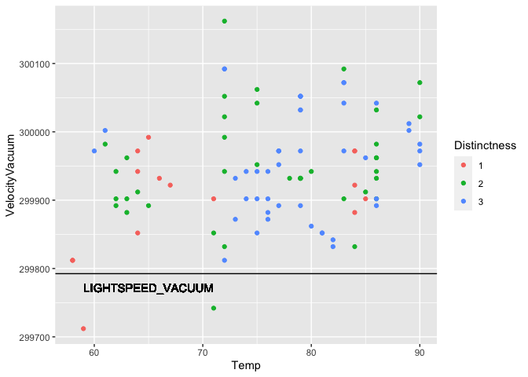
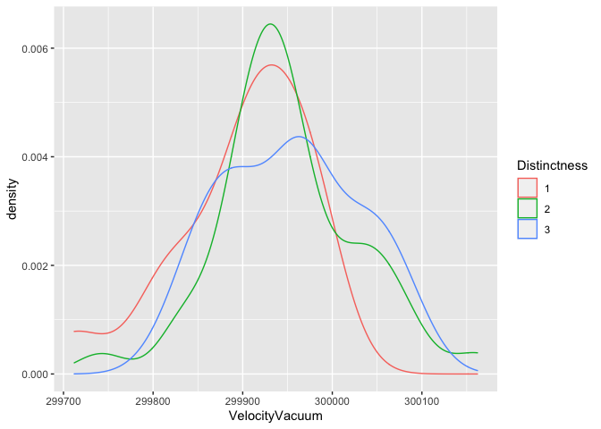
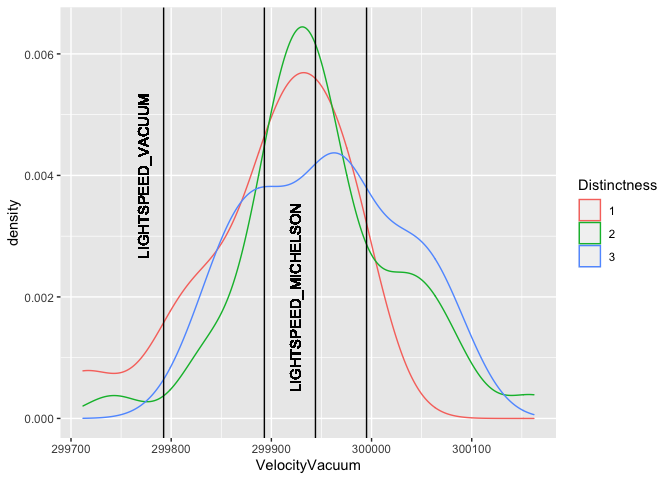
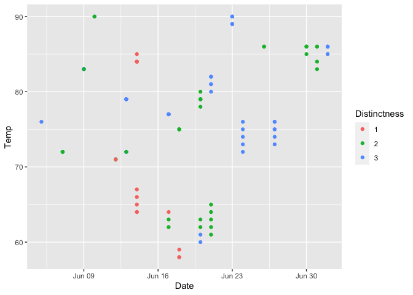

Michelson Speed-of-light Measurements
================
Hannah Sarver
2020-07-17

  - [Bibliography](#bibliography)

*Purpose*: When studying physical problems, there is an important
distinction between *error* and *uncertainty*. The primary purpose of
this challenge is to dip our toes into these factors by analyzing a real
dataset.

*Reading*: [Experimental Determination of the Velocity of
Light](https://play.google.com/books/reader?id=343nAAAAMAAJ&hl=en&pg=GBS.PA115)
(Optional)

``` r
# Libraries
library(tidyverse)
library(googlesheets4)

url <- "https://docs.google.com/spreadsheets/d/1av_SXn4j0-4Rk0mQFik3LLr-uf0YdA06i3ugE6n-Zdo/edit?usp=sharing"

# Parameters
LIGHTSPEED_VACUUM    <- 299792.458 # Exact speed of light in a vacuum (km / s)
LIGHTSPEED_MICHELSON <- 299944.00  # Michelson's speed estimate (km / s)
LIGHTSPEED_PM        <- 51         # Michelson error estimate (km / s)
```

*Background*: In 1879 Albert Michelson led an experimental campaign to
measure the speed of light. His approach was a development upon the
method of Foucault, and resulted in a new estimate of
\(v_0 = 299944 \pm 51\) kilometers per second (in a vacuum). This is
very close to the modern *exact* value of `r LIGHTSPEED_VACUUM`. In this
challenge, you will analyze Michelson’s original data, and explore some
of the factors associated with his experiment.

I’ve already copied Michelson’s data from his 1880 publication; the code
chunk below will load these data from a public googlesheet.

*Aside*: The speed of light is *exact* (there is **zero error** in the
value `LIGHTSPEED_VACUUM`) because the meter is actually
[*defined*](https://en.wikipedia.org/wiki/Metre#Speed_of_light_definition)
in terms of the speed of light\!

``` r
## Note: No need to edit this chunk!
gs4_deauth()
ss <- gs4_get(url)
df_michelson <-
  read_sheet(ss) %>%
  select(Date, Distinctness, Temp, Velocity) %>%
  mutate(Distinctness = as_factor(Distinctness))
```

    ## Reading from "michelson1879"

    ## Range "Sheet1"

``` r
df_michelson %>% glimpse
```

    ## Rows: 100
    ## Columns: 4
    ## $ Date         <dttm> 1879-06-05, 1879-06-07, 1879-06-07, 1879-06-07, 1879-06…
    ## $ Distinctness <fct> 3, 2, 2, 2, 2, 2, 3, 3, 3, 3, 2, 2, 2, 2, 2, 1, 3, 3, 2,…
    ## $ Temp         <dbl> 76, 72, 72, 72, 72, 72, 83, 83, 83, 83, 83, 90, 90, 71, …
    ## $ Velocity     <dbl> 299850, 299740, 299900, 300070, 299930, 299850, 299950, …

*Data dictionary*:

  - `Date`: Date of measurement
  - `Distinctness`: Distinctness of measured images: 3 = good, 2 = fair,
    1 = poor
  - `Temp`: Ambient temperature (Fahrenheit)
  - `Velocity`: Measured speed of light (km / s)

**q1** Re-create the following table (from Michelson (1880), pg. 139)
using `df_michelson` and `dplyr`. Note that your values *will not* match
those of Michelson *exactly*; why might this be?

| Distinctness | n  | MeanVelocity |
| ------------ | -- | ------------ |
| 3            | 46 | 299860       |
| 2            | 39 | 299860       |
| 1            | 15 | 299810       |

``` r
## TODO: Compute summaries
df_q1 <- 
  df_michelson %>%
  group_by(Distinctness) %>%
  summarize(
    n = n(),
    MeanVelocity = round(mean(Velocity), -1)
  ) %>%
  ungroup()
```

    ## `summarise()` ungrouping output (override with `.groups` argument)

``` r
df_q1 %>%
  arrange(desc(Distinctness)) %>%
  knitr::kable()
```

| Distinctness |  n | MeanVelocity |
| :----------- | -: | -----------: |
| 3            | 46 |       299860 |
| 2            | 39 |       299860 |
| 1            | 15 |       299810 |

**Observations**:

  - I rounded the mean to the nearest ten (interpreted in R as round to
    -1 digit) to match the table from Michelson. I would presume that he
    rounded his results as an accommodation for both or either of
    expected error in the data and effects of averaging.
  - Looking at the data in the table, it appears that the more distinct
    measurements agreed more closely with each other than the less
    distinct, but that the average value of Velocity measured in those
    observations is further from the exact value than the observations
    with Distinctness of 1.
      - There are more observations at the higher Distinctness levels,
        so the distance of the Distinctness 1 average from the others
        could be from the small sample size rather than something about
        those measurements actually being more accurate.

The `Velocity` values in the dataset are the speed of light *in air*;
Michelson introduced a couple of adjustments to estimate the speed of
light in a vacuum. In total, he added \(+92\) km/s to his mean estimate
for `VelocityVacuum` (from Michelson (1880), pg. 141). While this isn’t
fully rigorous (\(+92\) km/s is based on the mean temperature), we’ll
simply apply this correction to all the observations in the dataset.

**q2** Create a new variable `VelocityVacuum` with the \(+92\) km/s
adjustment to `Velocity`. Assign this new dataframe to `df_q2`.

``` r
## TODO: Adjust the data, assign to df_q2
df_q2 <-
  df_michelson %>%
  mutate(
    VelocityVacuum = Velocity + 92
  )
df_q2
```

    ## # A tibble: 100 x 5
    ##    Date                Distinctness  Temp Velocity VelocityVacuum
    ##    <dttm>              <fct>        <dbl>    <dbl>          <dbl>
    ##  1 1879-06-05 00:00:00 3               76   299850         299942
    ##  2 1879-06-07 00:00:00 2               72   299740         299832
    ##  3 1879-06-07 00:00:00 2               72   299900         299992
    ##  4 1879-06-07 00:00:00 2               72   300070         300162
    ##  5 1879-06-07 00:00:00 2               72   299930         300022
    ##  6 1879-06-07 00:00:00 2               72   299850         299942
    ##  7 1879-06-09 00:00:00 3               83   299950         300042
    ##  8 1879-06-09 00:00:00 3               83   299980         300072
    ##  9 1879-06-09 00:00:00 3               83   299980         300072
    ## 10 1879-06-09 00:00:00 3               83   299880         299972
    ## # … with 90 more rows

As part of his study, Michelson assessed the various potential sources
of error, and provided his best-guess for the error in his
speed-of-light estimate. These values are provided in
`LIGHTSPEED_MICHELSON`—his nominal estimate—and
`LIGHTSPEED_PM`—plus/minus bounds on his estimate. Put differently,
Michelson believed the true value of the speed-of-light probably lay
between `LIGHTSPEED_MICHELSON - LIGHTSPEED_PM` and `LIGHTSPEED_MICHELSON
+ LIGHTSPEED_PM`.

Let’s introduce some terminology:\[2\]

  - **Error** is the difference between a true value and an estimate of
    that value; for instance `LIGHTSPEED_VACUUM - LIGHTSPEED_MICHELSON`.
  - **Uncertainty** is an analyst’s *assessment* of the error.

Since a “true” value is often not known in practice, one generally does
not know the error. The best they can do is quantify their degree of
uncertainty. We will learn some means of quantifying uncertainty in this
class, but for many real problems uncertainty includes some amount of
human judgment.\[2\]

**q3** Compare Michelson’s speed of light estimate against the modern
speed of light value. Is Michelson’s estimate of the error (his
uncertainty) greater or less than the true error?

``` r
## TODO: Compare Michelson's estimate and error against the true value
## Your code here!
mich_error <- abs(LIGHTSPEED_VACUUM - LIGHTSPEED_MICHELSON)
mich_error
```

    ## [1] 151.542

``` r
mich_uncertainty <- LIGHTSPEED_PM
mich_uncertainty
```

    ## [1] 51

``` r
mich_uncertainty_error <- abs(mich_uncertainty - mich_error)
mich_uncertainty_error
```

    ## [1] 100.542

**Observations**:

  - Michelson’s uncertainty is much less than his actual error, about
    1/3 the value.
  - This would imply to me that he either missed or under-accounted for
    some sources of error.
  - To be fair, for values this large and hard to measure, I am still
    pretty impressed at the accuracy.

**q4** You have access to a few other variables. Construct a few
visualizations of `VelocityVacuum` against these other factors. Are
there other patterns in the data that might help explain the difference
between Michelson’s estimate and `LIGHTSPEED_VACUUM`?

``` r
## TODO: Visualize VelocityVacuum against variables in the data set
df_q2 %>%
  ggplot() +
  geom_point(
    aes(x = Temp, y = VelocityVacuum, color = Distinctness)
  ) +
  geom_hline(
    aes(yintercept = LIGHTSPEED_VACUUM)
  ) +
  geom_text(
    aes(65, LIGHTSPEED_VACUUM - 20, label = "LIGHTSPEED_VACUUM")
  )
```

<!-- -->

**Observations:**

  - There does not seem to be any clear relationship between the
    temperature and measured velocity, the measurements look fairly
    evenly distributed along both of those axes.
  - There also does not seem to be an obvious relationship between the
    distinctness and velocity, it looks to me like the measurements are
    more central in the range of measured velocities but this could just
    be the smaller number of datapoints.
  - There are a few further outlying velocity measurements, but these do
    not appear to be particularly correlated to any temperature range or
    distinctness level.
  - It is interesting that Michelson measured values mostly higher than
    the real value (even discounting the adjustment for expectation of
    air vs vacuum).

<!-- end list -->

``` r
## TODO: Visualize VelocityVacuum against variables in the data set
df_q2 %>%
  ggplot() +
  geom_density(
    aes(VelocityVacuum, group = Distinctness, color = Distinctness)
  )
```

<!-- -->

**Observations:**

  - Looking at the densities of the velocity vacuum measurements, we can
    see that they have a mostly normal distribution, with some bumps.
    What I take from this is that across measurements, the methods gave
    similar results with normally distributed “noise” in a range with a
    central peak.
  - The highest distinctness shows most “bumpy” shape. I do not have
    good intuition for why that is.
  - The peaks between the three distinctnesses are close together,
    meaning distinctness does not show a significant difference in where
    the measurements are centered. This indicates to me that there is
    really a large offset in the experimental error rather than
    variation in the data leading to an incorrect result.

<!-- end list -->

``` r
df_q2 %>%
  ggplot() +
  geom_density(
    aes(VelocityVacuum, group = Distinctness, color = Distinctness)
  ) +
  geom_vline(
    aes(xintercept = LIGHTSPEED_VACUUM)
  ) +
  geom_text(
    aes(LIGHTSPEED_VACUUM - 20, 0.004, angle = 90,
        label = "LIGHTSPEED_VACUUM")
  ) +
  geom_vline(
    aes(xintercept = LIGHTSPEED_MICHELSON)
  ) +
  geom_text(
    aes(LIGHTSPEED_MICHELSON - 20, 0.002, angle = 90,
        label = "LIGHTSPEED_MICHELSON")
  ) +
  geom_vline(
    aes(xintercept = LIGHTSPEED_MICHELSON + LIGHTSPEED_PM)
  ) +
  geom_vline(
    aes(xintercept = LIGHTSPEED_MICHELSON - LIGHTSPEED_PM)
  )
```

<!-- -->

**Observations:**

  - I added some annotations on the same graph as above to show where
    the Michelson and real value fall, with the expected error range on
    the Michelson value.
  - We do see that Michelson’s calculated mean pulls a bit higher than
    the peaks of the distributions of his (adjusted) measurements, which
    appears to me to be due to the 2 and 3 distinctnesses having bumps
    towards the higher side which will pull the average up.
  - The measurements still obviously center much higher than the real
    value.

<!-- end list -->

``` r
## TODO: Visualize variables in the data set
df_q2 %>%
  ggplot() +
  geom_point(
    aes(x = Date, y = Temp, color = Distinctness)
  )
```

<!-- -->

**Observations:**

  - I wanted to do a quick check of my expectations that both
    temperatures and distinctnesses would be clustered based on the date
    of each set of experiments. There are some clusters but also some
    single points, I would guess experiments run on their own rather
    than rapid changes in temperature.
  - My takeaway here is that it does not appear that date would be very
    interesting to look at in terms of any impact independent of the
    other factors.

## Bibliography

  - \[1\] Michelson, [Experimental Determination of the Velocity of
    Light](https://play.google.com/books/reader?id=343nAAAAMAAJ&hl=en&pg=GBS.PA115)
    (1880)
  - \[2\] Henrion and Fischhoff, [Assessing Uncertainty in Physical
    Constants](https://www.cmu.edu/epp/people/faculty/research/Fischoff-Henrion-Assessing%20uncertainty%20in%20physical%20constants.pdf)
    (1986)
