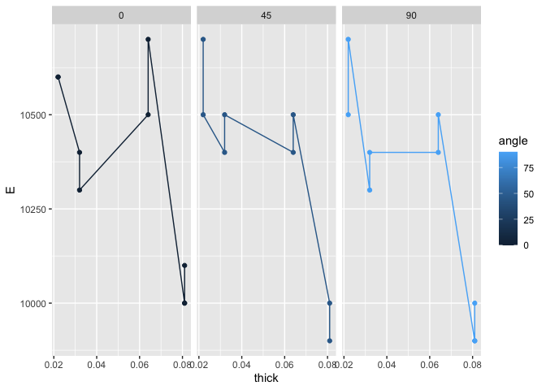
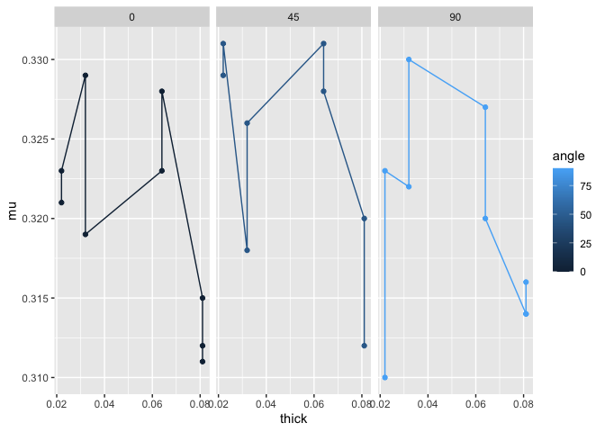
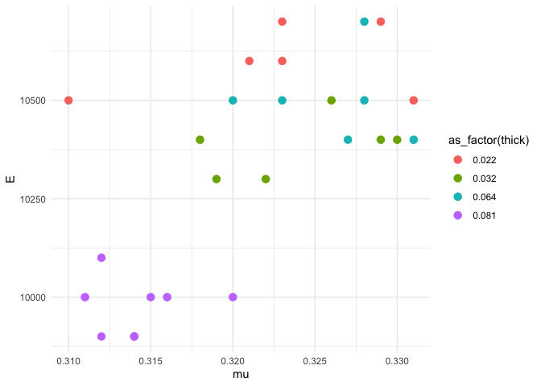

Aluminum Data
================
Hannah Sarver
2020-07-20

  - [Loading and Wrangle](#loading-and-wrangle)
  - [EDA](#eda)
      - [Initial checks](#initial-checks)
      - [Visualize](#visualize)
  - [References](#references)

*Purpose*: When designing structures such as bridges, boats, and planes,
the design team needs data about *material properties*. Often when we
engineers first learn about material properties through coursework, we
talk about abstract ideas and look up values in tables without ever
looking at the data that gave rise to published properties. In this
challenge you’ll study an aluminum alloy dataset: Studying these data
will give you a better sense of the challenges underlying published
material values.

In this challenge, you will load a real dataset, wrangle it into tidy
form, and perform EDA to learn more about the data.

``` r
library(tidyverse)
```

    ## ── Attaching packages ───────────────────────────────────────── tidyverse 1.3.0 ──

    ## ✓ ggplot2 3.3.2     ✓ purrr   0.3.4
    ## ✓ tibble  3.0.1     ✓ dplyr   1.0.0
    ## ✓ tidyr   1.1.0     ✓ stringr 1.4.0
    ## ✓ readr   1.3.1     ✓ forcats 0.5.0

    ## ── Conflicts ──────────────────────────────────────────── tidyverse_conflicts() ──
    ## x dplyr::filter() masks stats::filter()
    ## x dplyr::lag()    masks stats::lag()

*Background*: In 1946, scientists at the Bureau of Standards tested a
number of Aluminum plates to determine their
[elasticity](https://en.wikipedia.org/wiki/Elastic_modulus) and
[Poisson’s ratio](https://en.wikipedia.org/wiki/Poisson%27s_ratio).
These are key quantities used in the design of structural members, such
as aircraft skin under [buckling
loads](https://en.wikipedia.org/wiki/Buckling). These scientists tested
plats of various thicknesses, and at different angles with respect to
the [rolling](https://en.wikipedia.org/wiki/Rolling_\(metalworking\))
direction.

# Loading and Wrangle

<!-- -------------------------------------------------- -->

The `readr` package in the Tidyverse contains functions to load data
form many sources. The `read_csv()` function will help us load the data
for this challenge.

``` r
## NOTE: If you extracted all challenges to the same location,
## you shouldn't have to change this filename
filename <- "./data/stang.csv"

## Load the data
df_stang <- read_csv(filename)
```

    ## Parsed with column specification:
    ## cols(
    ##   thick = col_double(),
    ##   E_00 = col_double(),
    ##   mu_00 = col_double(),
    ##   E_45 = col_double(),
    ##   mu_45 = col_double(),
    ##   E_90 = col_double(),
    ##   mu_90 = col_double(),
    ##   alloy = col_character()
    ## )

``` r
df_stang
```

    ## # A tibble: 9 x 8
    ##   thick  E_00 mu_00  E_45  mu_45  E_90 mu_90 alloy  
    ##   <dbl> <dbl> <dbl> <dbl>  <dbl> <dbl> <dbl> <chr>  
    ## 1 0.022 10600 0.321 10700  0.329 10500 0.31  al_24st
    ## 2 0.022 10600 0.323 10500  0.331 10700 0.323 al_24st
    ## 3 0.032 10400 0.329 10400  0.318 10300 0.322 al_24st
    ## 4 0.032 10300 0.319 10500  0.326 10400 0.33  al_24st
    ## 5 0.064 10500 0.323 10400  0.331 10400 0.327 al_24st
    ## 6 0.064 10700 0.328 10500  0.328 10500 0.32  al_24st
    ## 7 0.081 10000 0.315 10000  0.32   9900 0.314 al_24st
    ## 8 0.081 10100 0.312  9900  0.312 10000 0.316 al_24st
    ## 9 0.081 10000 0.311    -1 -1      9900 0.314 al_24st

Note that these data are not tidy\! The data in this form are convenient
for reporting in a table, but are not ideal for analysis.

**q1** Tidy `df_stang` to produce `df_stang_long`. You should have
column names `thick, alloy, angle, E, mu`. Make sure the `angle`
variable is of correct type. Filter out any invalid values.

*Hint*: You can reshape in one `pivot` using the `".value"` special
value for `names_to`.

``` r
## TASK: Tidy `df_stang`
df_stang_long <-
  df_stang %>%
    pivot_longer(
      names_to = c(".value", "angle"),
      names_sep = "_",
      cols = c(-thick, -alloy)
    ) %>%
  mutate(angle = as.integer(angle)) %>%
  filter(E > 0)
df_stang_long
```

    ## # A tibble: 26 x 5
    ##    thick alloy   angle     E    mu
    ##    <dbl> <chr>   <int> <dbl> <dbl>
    ##  1 0.022 al_24st     0 10600 0.321
    ##  2 0.022 al_24st    45 10700 0.329
    ##  3 0.022 al_24st    90 10500 0.31 
    ##  4 0.022 al_24st     0 10600 0.323
    ##  5 0.022 al_24st    45 10500 0.331
    ##  6 0.022 al_24st    90 10700 0.323
    ##  7 0.032 al_24st     0 10400 0.329
    ##  8 0.032 al_24st    45 10400 0.318
    ##  9 0.032 al_24st    90 10300 0.322
    ## 10 0.032 al_24st     0 10300 0.319
    ## # … with 16 more rows

Use the following tests to check your work.

``` r
## NOTE: No need to change this
## Names
assertthat::assert_that(
              setequal(
                df_stang_long %>% names,
                c("thick", "alloy", "angle", "E", "mu")
              )
            )
```

    ## [1] TRUE

``` r
## Dimensions
assertthat::assert_that(all(dim(df_stang_long) == c(26, 5)))
```

    ## [1] TRUE

``` r
## Type
assertthat::assert_that(
              (df_stang_long %>% pull(angle) %>% typeof()) == "integer"
            )
```

    ## [1] TRUE

``` r
print("Very good!")
```

    ## [1] "Very good!"

# EDA

<!-- -------------------------------------------------- -->

## Initial checks

<!-- ------------------------- -->

**q2** Perform a basic EDA on the aluminum data *without visualization*.
Use your analysis to answer the questions under *observations* below. In
addition, add your own question that you’d like to answer about the
data.

``` r
##
summary(df_stang_long)
```

    ##      thick            alloy               angle          E        
    ##  Min.   :0.02200   Length:26          Min.   : 0   Min.   : 9900  
    ##  1st Qu.:0.03200   Class :character   1st Qu.: 0   1st Qu.:10025  
    ##  Median :0.06400   Mode  :character   Median :45   Median :10400  
    ##  Mean   :0.05215                      Mean   :45   Mean   :10335  
    ##  3rd Qu.:0.08100                      3rd Qu.:90   3rd Qu.:10500  
    ##  Max.   :0.08100                      Max.   :90   Max.   :10700  
    ##        mu        
    ##  Min.   :0.3100  
    ##  1st Qu.:0.3152  
    ##  Median :0.3215  
    ##  Mean   :0.3212  
    ##  3rd Qu.:0.3277  
    ##  Max.   :0.3310

**Observations**:

  - Is there “one true value” for the material properties of Aluminum?
      - No, properties vary across parameters
  - How many aluminum alloys were tested? How do you know?
      - Looks like just one; the summary is not super clear but since
        it’s a small data set we can confirm by glancing through the
        full set
  - What angles were tested?
      - 0, 45, 90
  - What thicknesses were tested?
      - 0.022, 0.032, 0.064, 0.081 (units?)
  - Which of angle or thickness affects the material properties more? Is
    the answer different for E versus mu?
  - Probably out of scope for data science, but what values would be
    desirable for E or mu for given engineering work?

## Visualize

<!-- ------------------------- -->

**q3** Create a visualization to investigate your question from q1
above. Can you find an answer to your question using the dataset? Would
you need additional information to answer your question?

``` r
## TASK: Investigate your question from q1 here
df_stang_long %>%
  ggplot(aes(x = thick, y = E, color = angle)) +
  geom_point() +
  geom_line() +
  facet_grid(. ~ angle)
```

<!-- -->

**Observations**:

  - The general shape of the curve for E versus thickness looks similar
    across the three angles measured.
  - It appears that the measured value for E jumps around a bit at the
    lower thickness values and then very steeply drops at the highest
    thickness of 0.081 in.
  - There are not very many data points, so my attempts to look at any
    smoothed graphs did not seem to show much trend that felt
    trustworthy, other than the drop at the highest thickness.
  - The values of E seem to be on very discrete points, and glancing at
    the data table shows accuracy only to the nearest 100, so that also
    makes it a bit harder to see trends along the lower thickness
    values.
  - Overall for E it appears that thickness matters more than angle, but
    really only shows much difference for the highest thickness value.

<!-- end list -->

``` r
df_stang_long %>%
  ggplot(aes(x = thick, y = mu, color = angle)) +
  geom_point() +
  geom_line() +
  facet_grid(. ~ angle)
```

<!-- -->

**Observations**:

  - The curves for mu look somewhat similar to those for E - at a high
    level the values jump around a bit at lower thicknesses and then
    drop off more steeply at the highest thickness value, although to a
    lesser extent than we saw for E.
  - An exception to the above observation is one of the points of
    measured mu at 90 degrees angle and 0.022 in thickness, which
    appears to be a bit of an outlier (but again is a little hard to
    reason about since there is not that much data here).
  - Overall as with E the angle does not seem to have very much effect
    on the measured mu, and the thickness does not have much either
    besides the drop at the highest thickness value.
  - Between E and mu, the dip at the highest thickness appears a bit
    more prominent for E.

**q4** Consider the following statement:

“A material’s property (or material property) is an intensive property
of some material, i.e. a physical property that does not depend on the
amount of the material.”\[2\]

Note that the “amount of material” would vary with the thickness of a
tested plate. Does the following graph support or contradict the claim
that “elasticity `E` is an intensive material property.” Why or why not?
Is this evidence *conclusive* one way or another? Why or why not?

``` r
## NOTE: No need to change; run this chunk
df_stang_long %>%

  ggplot(aes(mu, E, color = as_factor(thick))) +
  geom_point(size = 3) +
  theme_minimal()
```

<!-- -->

**Observations**:

  - This graph appears to contradict the statement, since the group of
    points for the 0.081 in thickness alloy all have distinctly lower
    measured E values than the other thicknesses, although among the
    three lower thicknesses there is not a clear relationship.
  - I would say this data shows a pretty conclusive contradiction,
    presuming that the experiment had some measures to control for other
    property differences in the higher thickness samples (I am not sure
    I know enough about the production and test to say what, exactly,
    gotta read some more) that might impact the elasticity measurement.

# References

<!-- -------------------------------------------------- -->

\[1\] Stang, Greenspan, and Newman, “Poisson’s ratio of some structural
alloys for large strains” (1946) Journal of Research of the National
Bureau of Standards, (pdf
link)\[<https://nvlpubs.nist.gov/nistpubs/jres/37/jresv37n4p211_A1b.pdf>\]

\[2\] Wikipedia, *List of material properties*, accessed 2020-06-26,
(link)\[<https://en.wikipedia.org/wiki/List_of_materials_properties>\]
