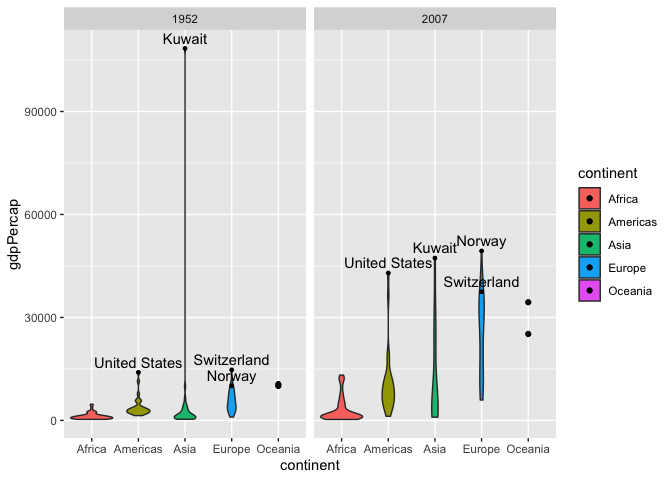

Gapminder
================
Hannah Sarver
2020-07-22

  - [Guided EDA](#guided-eda)
  - [Your Own EDA](#your-own-eda)

*Purpose*: Learning to do EDA well takes practice\! In this challenge
you’ll further practice EDA by first completing a guided exploration,
then by conducting your own investigation. This challenge will also give
you a chance to use the wide variety of visual tools we’ve been
learning.

``` r
library(tidyverse)
```

    ## ── Attaching packages ───────────────────────────────────────── tidyverse 1.3.0 ──

    ## ✓ ggplot2 3.3.2     ✓ purrr   0.3.4
    ## ✓ tibble  3.0.1     ✓ dplyr   1.0.0
    ## ✓ tidyr   1.1.0     ✓ stringr 1.4.0
    ## ✓ readr   1.3.1     ✓ forcats 0.5.0

    ## ── Conflicts ──────────────────────────────────────────── tidyverse_conflicts() ──
    ## x dplyr::filter() masks stats::filter()
    ## x dplyr::lag()    masks stats::lag()

``` r
library(gapminder)
library(grid)
library(gridExtra)
```

    ## 
    ## Attaching package: 'gridExtra'

    ## The following object is masked from 'package:dplyr':
    ## 
    ##     combine

*Background*: [Gapminder](https://www.gapminder.org/about-gapminder/) is
an independent organization that seeks to educate people about the state
of the world. They promote a “fact-based worldview” by focusing on data.
The dataset we’ll study in this challenge is from Gapminder.

# Guided EDA

<!-- -------------------------------------------------- -->

First, we’ll go through a round of *guided EDA*. Try to pay attention to
the high-level process we’re going through—after this guided round
you’ll be responsible for doing another cycle of EDA on your own\!

**q0** Perform your “first checks” on the dataset. What variables are in
this dataset?

``` r
## TASK: Do your "first checks" here!
summary(gapminder)
```

    ##         country        continent        year         lifeExp     
    ##  Afghanistan:  12   Africa  :624   Min.   :1952   Min.   :23.60  
    ##  Albania    :  12   Americas:300   1st Qu.:1966   1st Qu.:48.20  
    ##  Algeria    :  12   Asia    :396   Median :1980   Median :60.71  
    ##  Angola     :  12   Europe  :360   Mean   :1980   Mean   :59.47  
    ##  Argentina  :  12   Oceania : 24   3rd Qu.:1993   3rd Qu.:70.85  
    ##  Australia  :  12                  Max.   :2007   Max.   :82.60  
    ##  (Other)    :1632                                                
    ##       pop              gdpPercap       
    ##  Min.   :6.001e+04   Min.   :   241.2  
    ##  1st Qu.:2.794e+06   1st Qu.:  1202.1  
    ##  Median :7.024e+06   Median :  3531.8  
    ##  Mean   :2.960e+07   Mean   :  7215.3  
    ##  3rd Qu.:1.959e+07   3rd Qu.:  9325.5  
    ##  Max.   :1.319e+09   Max.   :113523.1  
    ## 

**Observations**:

  - Write the variable names here

**q1** Determine the most and least recent years in the `gapminder`
dataset.

``` r
## TASK: Find the largest and smallest values of `year` in `gapminder`
year_max <- summarize(gapminder, max(year))
year_min <- summarize(gapminder, min(year))
```

Use the following test to check your work.

``` r
## NOTE: No need to change this
assertthat::assert_that(year_max %% 7 == 5)
```

    ## [1] TRUE

``` r
assertthat::assert_that(year_max %% 3 == 0)
```

    ## [1] TRUE

``` r
assertthat::assert_that(year_min %% 7 == 6)
```

    ## [1] TRUE

``` r
assertthat::assert_that(year_min %% 3 == 2)
```

    ## [1] TRUE

``` r
print("Nice!")
```

    ## [1] "Nice!"

**q2** Filter on years matching `year_min`, and make a plot of the GDE
(…does this mean GDP?) per capita against continent. Choose an
appropriate `geom_` to visualize the data. What observations can you
make?

You may encounter difficulties in visualizing these data; if so document
your challenges and attempt to produce the most informative visual you
can.

``` r
## TASK: Create a visual of gdpPercap vs continent
gapminder_cont_count <-
  gapminder %>%
  filter(as.integer(year) == as.integer(year_min)) %>%
  group_by(continent) %>%
  mutate(
    cont_count = n(),
  ) %>%
  ungroup()

oceania <-
  gapminder %>%
  filter(as.integer(year) == as.integer(year_min)) %>%
  filter(continent == "Oceania")

gapminder_cont_count %>%
  filter(as.integer(year) == as.integer(year_min)) %>%
  ggplot(mapping = aes(x = continent, y = gdpPercap, fill = continent)) +
  geom_violin() +
  geom_point(data = oceania) +
  stat_summary(
    fun.y = max,
    mapping = aes(
      x = as.numeric(continent) + 0.2,
      label = cont_count
    ),
    geom = 'text'
  ) +
  ggtitle("1952 GDP Per Capita by Continent with Count of Countries in Each")
```

    ## Warning: `fun.y` is deprecated. Use `fun` instead.

<!-- -->

**Observations**:

  - Most continents show a wider base of lower-GDP-per-capita countries,
    with a tapering top of fewer richer countries.
  - Europe has a relatively narrower bases of fewer poorer countries,
    and Africa has a much wider base of many relatively poorer
    countries.
  - Asia has at least one very far outlier, and the Americas, Europe,
    and to an extent Africa also show tapering off towards their higher
    GDP per capita countr(ies).
  - Oceania has only two countries listed in 1952, and in this plot all
    we can really see is that the one with max GDP per capita has a
    value a little lower than Europe and Americas’ max.
  - There are the most total countries in Africa, and as mentioned only
    very few in Oceania. The violin plot shows each shape with relative
    width within that continent, so it is useful for comparison of
    distribution but not as much for total number of countries across
    the continents.

**Difficulties & Approaches**:

  - WTF is the deal with the filter function and why does it not treat
    the type information the same as the rest of R?
  - I found the violin plot fairly intuitive for visualizing the spread
    of GDP-per-capita across each continent, but wanted to understand
    the count of countries within each continent to be able to compare
    better, and spent way too long trying to get per-continent country
    counts to show up despite that obviously being an internal part of
    generating the plot.

**q3** You should have found at least three outliers in q2. Identify
those outliers (figure out which countries they are).

``` r
## TASK: Identify the outliers from q2
gapminder %>%
  filter(as.integer(year) == as.integer(year_min)) %>%
  top_n(3, gdpPercap)
```

    ## # A tibble: 3 x 6
    ##   country       continent  year lifeExp       pop gdpPercap
    ##   <fct>         <fct>     <int>   <dbl>     <int>     <dbl>
    ## 1 Kuwait        Asia       1952    55.6    160000   108382.
    ## 2 Switzerland   Europe     1952    69.6   4815000    14734.
    ## 3 United States Americas   1952    68.4 157553000    13990.

**Observations**:

  - The furthest outliers look likely to be Kuwait (by far) in Asia,
    Switzerland in Europe, and the US and Canada in the Americas

**q4** Create a plot similar to yours from q2 studying both `year_min`
and `year_max`. Find a way to highlight the outliers from q3 on your
plot. Compare the patterns between `year_min` and `year_max`.

*Hint*: We’ve learned a lot of different ways to show multiple
variables; think about using different aesthetics or facets.

``` r
## TASK: Create a visual of gdpPercap vs continent year_min
outliers <- gapminder %>%
  filter((as.integer(year) == as.integer(year_min))
         | (as.integer(year) == as.integer(year_max))) %>%
  filter(
    # Outlying countries repeated as strings cause I had trouble using the output from the top_n table above, and I wanted to show Norway since it overtakes Switzerland by 2007.
    country == "Kuwait" |
    country == "Switzerland" |
    country == "Norway" |
    country == "United States"
  )

oceania <-
  gapminder %>%
  filter((as.integer(year) == as.integer(year_min))
         | (as.integer(year) == as.integer(year_max))) %>%
  filter(continent == "Oceania")

gapminder %>%
  filter((as.integer(year) == as.integer(year_min))
         | (as.integer(year) == as.integer(year_max))) %>%
  ggplot(mapping = aes(x = continent, y = gdpPercap, fill = continent)) +
  geom_violin() +
  geom_point(data = oceania) +
  geom_point(data = outliers, size = 1) +
  geom_text(data = outliers, mapping = aes(label = country), vjust = -0.5) +
  facet_wrap(~year)
```

<!-- -->

**Observations**:

  - Daaaaaaamn Kuwait what is up (I mean, oil, but wow).
  - Mostly outliers stay outliers, although Kuwait came down a whole lot
    between 1952 and 2007.
  - Norway is winning in Europe as of 2007.
  - Europe moved up its lower base, implying there are few or no very
    poor countries.
  - Africa has had many countries move up, but not as much (in terms of
    absolute delta in GDP per capita) as the highest countries among the
    other continents.

# Your Own EDA

<!-- -------------------------------------------------- -->

Now it’s your turn\! We just went through guided EDA considering the GDP
per capita at two time points. You can continue looking at outliers,
consider different years, repeat the exercise with `lifeExp`, consider
the relationship between variables, or something else entirely.

**q5** Create *at least* three new figures below. With each figure, try
to pose new questions about the data.

Overall Question: How does GDP per capita impact life expectancy,
especially over time?

First Exploration: How has life expectancy varied across the time span
in the dataset? Within any year, is there any very obvious relationship
between life expectancy and GDP per capita?

``` r
gapminder_avg_gdp <-
  gapminder %>%
  filter(country != "Kuwait") %>% # Remove outlier to improve visual clarity on gdpPercap
  group_by(year) %>%
  mutate(
    year_median_gdppc = median(gdpPercap),
  ) %>%
  ungroup()

outliers <- gapminder %>%
  filter(
    (year == 1992 & country == "Rwanda") |
    (year == 1997 & country == "Rwanda") |
    (year == 1977 & country == "Cambodia") |
    (year == 2007 & country == "Swaziland")
  )

gapminder_avg_gdp %>%
  mutate(scaledGdpPercap = gdpPercap / year_median_gdppc) %>%
  ggplot(aes(x = year, y = lifeExp)) +
  geom_point(aes(color = scaledGdpPercap)) +
  geom_smooth() +
  geom_text(data = outliers, mapping = aes(label = country), vjust = 1.4, hjust = 0.75) +
  ggtitle("Yearly life expectancy with GDP per cap scaled by year's median minus Kuwait")
```

    ## `geom_smooth()` using method = 'gam' and formula 'y ~ s(x, bs = "cs")'

<!-- -->

**Observations**:

  - Life expectancy has risen over time (as we might expect from medical
    and technological advances), although it appears that the curve has
    declined in its rate of rise from 1987 or so.
  - If we look at the very bottom of each year for countries with the
    lowest life expectancy, there is some rise in the lowest values from
    1952 to 1987, but then not much change from then on. Meanwhile at
    the very top of each year, there is a steady rise in the highest
    life expectancies over time.
  - There are a few extreme outliers at the low end, presumably
    indicative of specific events (ie civil war, genocide) in those
    countries.
  - From this visualization, what we can see in terms of how life
    expectancy varies with GDP per capita is that there tend to be more
    countries with higher GDP per capita with the highest life
    expectancies. I scaled the GDP per cap by the median value each year
    so that we can still see some relationship in the earlier years (and
    not just all dark points since there are higher GDP per cap values
    in the range over time).
  - There do seem to be a few countries in the middle of the life
    expectancy range in some years that have very high GDP per capita.

Next Exploration: How does life expectancy vary with GDP?

``` r
gapminder %>%
  filter(as.integer(year) >= as.integer(year_max) - 25) %>%
  ggplot(aes(x = gdpPercap, y = lifeExp)) +
  geom_point() +
  geom_smooth() +
  facet_wrap(~ year) +
  ggtitle("Life Expectancy against GDP per Capita 1982-2007")
```

    ## `geom_smooth()` using method = 'loess' and formula 'y ~ x'

<!-- -->

**Observations**:

  - There is a fairly consistently shaped curve where life expectancy
    rises quickly with increasing GDP per capita for the early range,
    then levels off and rises only very slowly with increasing GDP per
    capita.
  - We see a few outliers with much lower life expectancy than other
    countries with similar GDP per capita - might guess these are likely
    to be countries with specific life-threatening conflicts or
    disasters in those years.
  - Year over year, the curve looks about the same but we can see the
    richer end getting richer (without that much gain in life
    expectancy) and the poorest set of countries not gaining much wealth
    or very much gain in life expectancy, generally.

Next Exploration: How do life expectancy and GDP per capita vary over
time in the countries with the highest and lowest GDP per cap values?
We’ll look at the highest and lowest from 2007 over time (would be
interesting to look at the highest/lowest from other years and see how
that changes over time too, maybe later).

``` r
# highest_gdppc <- gapminder %>%
#   filter(as.integer(year) == as.integer(year_max)) %>%
#   top_n(5, gdpPercap) %>%
#   select(country)
# 
# lowest_gdppc <- gapminder %>%
#   filter(as.integer(year) == as.integer(year_max)) %>%
#   top_n(-5, gdpPercap) %>%
#   select(country)

# Could not figure out how to test group membership in the table data type so repeated manually as vectors here to be able to filter... probably a better way to do that

highest_gdppc <- c("Ireland","Kuwait","Norway","Singapore","United States")
lowest_gdppc <- c("Burundi","Congo, Dem. Rep.","Guinea-Bissau","Liberia","Zimbabwe")
highest_gdppc_3 <- c("Kuwait","Norway","Singapore")
lowest_gdppc_3 <- c("Burundi","Congo, Dem. Rep.","Liberia")

# TODO: Add titles, move color legends below to give more graph space...
# Ended up doing this "offline" for the presentation, so leaving it all a bit squished here

plot1 <- gapminder %>%
  filter(country %in% highest_gdppc) %>%
  ggplot(mapping = aes(group = country, color = country)) +
  geom_line(mapping = aes(year, gdpPercap)) #+
  #ggtitle("GDP per Capita, Life Expectancy over time for Richest 5 Countries") +
  #theme(legend.position="none")

plot2 <- gapminder %>%
  filter(country %in% highest_gdppc) %>%
  ggplot(mapping = aes(group = country, color = country)) +
  geom_line(mapping = aes(year, lifeExp)) #+
  #theme(legend.position="none")

plot3 <- gapminder %>%
  filter(country %in% lowest_gdppc) %>%
  ggplot(mapping = aes(group = country, color = country)) +
  geom_line(mapping = aes(year, gdpPercap)) #+
  #theme(legend.position="none")
  #ggtitle("GDP per Capita, Life Expectancy over time for Poorest 5 Countries")

plot4 <- gapminder %>%
  filter(country %in% lowest_gdppc) %>%
  ggplot(mapping = aes(group = country, color = country)) +
  geom_line(mapping = aes(year, lifeExp)) #+
  #theme(legend.position="none")

grid.arrange(plot1, plot2, plot3, plot4, nrow = 2)
```

<!-- -->

**Observations**:

  - There are clearer trends among the richest countries than the
    poorest.
      - Generally the richest countries gained GDP per capita and life
        expectancy over time, with what look like vaguely linear curves
        for the most part, although Kuwait followed a more interesting
        path on both factors but ended up in a similar range to the
        other richest countries in both.
      - The poorest countries don’t show as clear an upward trend on
        either graph, with most countries’ GDP per capita staying close
        to the same or spiking up and ending a bit lower. In terms of
        life expectancy, there is still a trend upward over time,
        showing that some increase is possible without gaining wealth
        (through technology advancement and access, perhaps). Zimbabwe
        shows an interesting pattern in life expectancy dropping steeply
        from 1987-2000, that I’d want to research a bit to understand
        based on events in that country.

<!-- end list -->

``` r
# Some other ways I experimented with viewing the data but didn't find as useful.
# Left here as a reference, mainly for myself :P

# gapminder %>%
#   filter(as.integer(year) >= as.integer(year_max) - 25) %>%
#   filter((country %in% highest_gdppc) | (country %in% lowest_gdppc)) %>%
#   ggplot(aes(x = gdpPercap, y = lifeExp, color = country)) +
#   geom_point() +
#   facet_wrap(~ year)
# 
# gapminder_scale_by_ctry <-
#   gapminder %>%
#   group_by(country) %>%
#   mutate(
#     country_median_gdppc = median(gdpPercap),
#     country_median_le = median(lifeExp)
#   ) %>%
#   ungroup()
# 
# gapminder_scale_by_ctry %>%
#   filter((country %in% highest_gdppc) | (country %in% lowest_gdppc)) %>%
#   ggplot(mapping = aes(group = country, color = country)) +
#   geom_line(mapping = aes(year, gdpPercap/country_median_gdppc))
# 
# gapminder_scale_by_ctry %>%
#   filter((country %in% highest_gdppc) | (country %in% lowest_gdppc)) %>%
#   ggplot(mapping = aes(group = country, color = country)) +
#   geom_line(mapping = aes(year, lifeExp/country_median_le))
```
