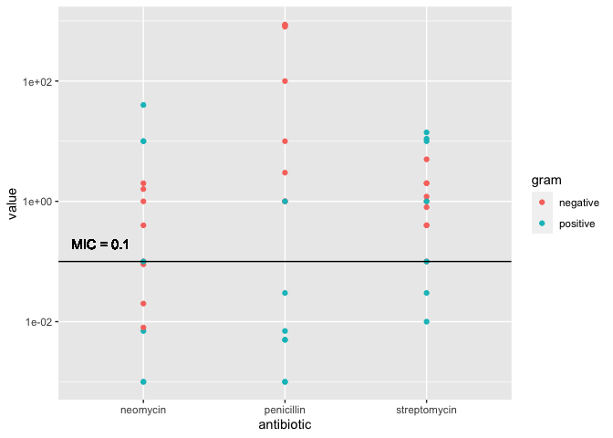
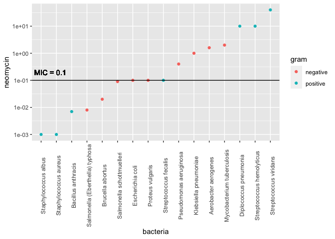
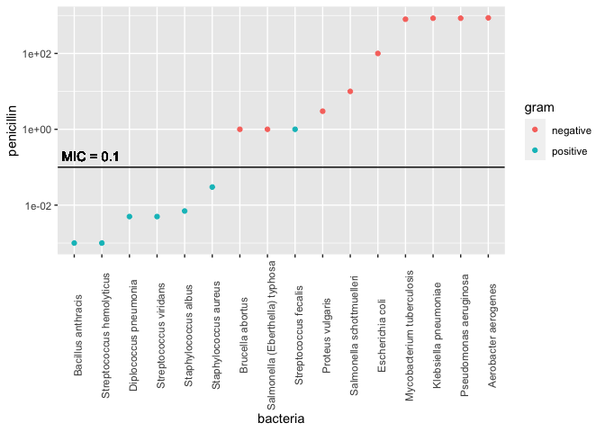
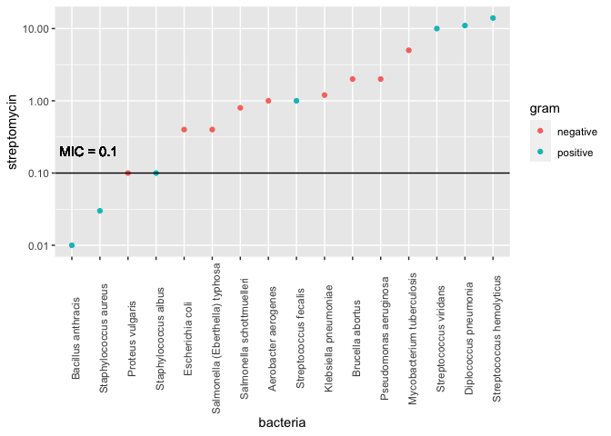

Antibiotics
================
Hannah Sarver
2020-07-28

  - [Visualization](#visualization)
      - [Purpose: Compare Effectiveness](#purpose-compare-effectiveness)
      - [Purpose: Categorize Bacteria](#purpose-categorize-bacteria)
  - [References](#references)

*Purpose*: To create an effective visualization, we need to keep our
*purpose* firmly in mind. There are many different ways to visualize
data, and the only way we can judge efficacy is with respect to our
purpose.

In this challenge you’ll visualize the same data in two different ways,
aimed at two different purposes.

*Note*: Please complete your initial visual design **alone**. Work on
both of your graphs alone, and save a version to your repo *before*
coming together with your team. This way you can all bring a diversity
of ideas to the table\!

``` r
library(tidyverse)
```

    ## ── Attaching packages ───────────────────────────────────────── tidyverse 1.3.0 ──

    ## ✓ ggplot2 3.3.2     ✓ purrr   0.3.4
    ## ✓ tibble  3.0.1     ✓ dplyr   1.0.0
    ## ✓ tidyr   1.1.0     ✓ stringr 1.4.0
    ## ✓ readr   1.3.1     ✓ forcats 0.5.0

    ## ── Conflicts ──────────────────────────────────────────── tidyverse_conflicts() ──
    ## x dplyr::filter() masks stats::filter()
    ## x dplyr::lag()    masks stats::lag()

``` r
library(ggrepel)
```

*Background*: The data\[1\] we study in this challenge report the
[*minimum inhibitory
concentration*](https://en.wikipedia.org/wiki/Minimum_inhibitory_concentration)
(MIC) of three drugs for different bacteria. The smaller the MIC for a
given drug and bacteria pair, the more practical the drug is for
treating that particular bacteria. An MIC value of *at most* 0.1 is
considered necessary for treating human patients.

These data report MIC values for three antibiotics—penicillin,
streptomycin, and neomycin—on 16 bacteria. Bacteria are categorized into
a genus based on a number of features, including their resistance to
antibiotics.

``` r
## NOTE: If you extracted all challenges to the same location,
## you shouldn't have to change this filename
filename <- "./data/antibiotics.csv"

## Load the data
df_antibiotics <- read_csv(filename)
```

    ## Parsed with column specification:
    ## cols(
    ##   bacteria = col_character(),
    ##   penicillin = col_double(),
    ##   streptomycin = col_double(),
    ##   neomycin = col_double(),
    ##   gram = col_character()
    ## )

``` r
df_antibiotics %>% knitr::kable()
```

| bacteria                        | penicillin | streptomycin | neomycin | gram     |
| :------------------------------ | ---------: | -----------: | -------: | :------- |
| Aerobacter aerogenes            |    870.000 |         1.00 |    1.600 | negative |
| Brucella abortus                |      1.000 |         2.00 |    0.020 | negative |
| Bacillus anthracis              |      0.001 |         0.01 |    0.007 | positive |
| Diplococcus pneumonia           |      0.005 |        11.00 |   10.000 | positive |
| Escherichia coli                |    100.000 |         0.40 |    0.100 | negative |
| Klebsiella pneumoniae           |    850.000 |         1.20 |    1.000 | negative |
| Mycobacterium tuberculosis      |    800.000 |         5.00 |    2.000 | negative |
| Proteus vulgaris                |      3.000 |         0.10 |    0.100 | negative |
| Pseudomonas aeruginosa          |    850.000 |         2.00 |    0.400 | negative |
| Salmonella (Eberthella) typhosa |      1.000 |         0.40 |    0.008 | negative |
| Salmonella schottmuelleri       |     10.000 |         0.80 |    0.090 | negative |
| Staphylococcus albus            |      0.007 |         0.10 |    0.001 | positive |
| Staphylococcus aureus           |      0.030 |         0.03 |    0.001 | positive |
| Streptococcus fecalis           |      1.000 |         1.00 |    0.100 | positive |
| Streptococcus hemolyticus       |      0.001 |        14.00 |   10.000 | positive |
| Streptococcus viridans          |      0.005 |        10.00 |   40.000 | positive |

# Visualization

<!-- -------------------------------------------------- -->

## Purpose: Compare Effectiveness

<!-- ------------------------- -->

**q1** Create a visualization of `df_antibiotics` that helps you to
compare the effectiveness of the three antibiotics across all the
bacteria reported. Can you make any broad statements about antibiotic
effectiveness?

``` r
## TASK: Create your visualization
df_bacteria_grp <- df_antibiotics %>%
  pivot_longer(cols = c(-bacteria, -gram), names_to = "antibiotic")

df_bacteria_grp %>%
  ggplot() +
  #geom_boxplot(aes(antibiotic, value)) +
  geom_point(aes(antibiotic, value, color = gram)) +
  scale_y_log10() +
  geom_hline(yintercept = 0.1) +
  geom_text(aes(0.7, 0.2, label = "MIC = 0.1"))
```

<!-- -->

**Observations**:

  - Most antibiotic-bacteria pairs appear to have MIC greater than
    acceptable for human treatment.
  - All three antibiotics show a range of MIC values across the
    bacteria, but penicillin has some very far outliers with super high
    values (prompting the log scale y axis).
  - More of the bacteria under MIC 0.1 for any antibiotic have positive
    gram than negative, and all of those for penicillin and
    streptomycin. But there is not an obvious pattern that positive gram
    show lower MIC than negative generally, although for penicillin it
    seems that way.
  - Out of these three antibiotics, neomycin has the most bacteria with
    MIC at or under 0.1, although not by a whole lot. I am not sure it
    is really enough to say that that antibiotic is much more effective
    than the others in general.

## Purpose: Categorize Bacteria

<!-- ------------------------- -->

The *genus* of a living organism is a human categorization, based on
various characteristics of the organism. Since these categories are
based on numerous factors, we will tend to see clusters if we visualize
data according to relevant variables. We can use these visuals to
categorize observations, and to question whether given categories are
reasonable\!

**q2** Create a visualization of `df_antibiotics` that helps you to
categorize bacteria according to the variables in the data. Document
your observations on how how clusters of bacteria in the variables do—or
don’t—align with their *genus* classification.

``` r
## TASK: Create your visualization
df_neomycin <- df_antibiotics %>%
  mutate(bacteria = fct_reorder(bacteria, neomycin))

df_penicillin <- df_antibiotics %>%
  mutate(bacteria = fct_reorder(bacteria, penicillin))

df_streptomycin <- df_antibiotics %>%
  mutate(bacteria = fct_reorder(bacteria, streptomycin))

p1 <- df_antibiotics %>%
  ggplot() +
  geom_point(df_neomycin, mapping = aes(bacteria, neomycin, color = gram)) +
  scale_y_log10() +
  geom_hline(yintercept = 0.1) +
  geom_text(aes(1.6, 0.2, label = "MIC = 0.1")) +
  theme(axis.text.x = element_text(angle = 90))

p2 <- df_antibiotics %>%
  ggplot() +
  geom_point(df_penicillin, mapping = aes(bacteria, penicillin, color = gram)) +
  scale_y_log10() +
  geom_hline(yintercept = 0.1) +
  geom_text(aes(1.6, 0.2, label = "MIC = 0.1")) +
  theme(axis.text.x = element_text(angle = 90))

p3 <- df_antibiotics %>%
  ggplot() +
  geom_point(df_streptomycin, mapping = aes(bacteria, streptomycin, color = gram)) +
  scale_y_log10() +
  geom_hline(yintercept = 0.1) +
  geom_text(aes(1.6, 0.2, label = "MIC = 0.1")) +
  theme(axis.text.x = element_text(angle = 90))

#grid.arrange(p1, p2, p3)
p1
```

<!-- -->

``` r
p2
```

<!-- -->

``` r
p3
```

<!-- -->

**Observations**:

  - I chose to look for patterns sorting bacteria by MIC within each
    antibiotic, and seeing if anything jumped out by genus.
  - For neomycin:
      - It appears to be most effective for the two staphylococcus
        bacteria, also effective for the two salmonella and some others.
      - The streptococcus bacteria are not in agreement on its
        effectiveness, with two having the highest MIC values and one
        right on the 0.1 line.
  - For penicillin:
      - It is effective for some of the same bacteria as neomycin is.
        Both staphylococcus, and bacillus.
      - It appears more effective for streptococcus than neomycin is,
        with one over the 0.1 line but not so far over.
      - Salmonella show similar MIC to each other (on log scale y axes).
      - We can again see clearly the split by gram, and the very far
        outlying MIC values where penicillin appears very ineffective
        for some bacteria.
      - Interesting gap between low and high MIC values, with no
        bacteria on or above MIC = 0.1 until 1.0.
  - For streptomycin:
      - Only shows MIC at or below 0.1 for a few bacteria, as we
        observed above. These include some of the same bacteria as the
        other antibiotics (staphylococcus and bacillus).
      - I might have guessed from the name that it would be effective
        against streptococcus, but those show some of the highest MIC
        values.
      - Shows a relatively even spread (linear-ish on a log scale)
        relative to the other two where we see some plateaus of groups
        of bacteria with close MIC values.
  - Overall, there are a few patterns:
      - The two staphylococcus bacteria and bacillus are treatable by
        any of the three antibiotics shown.
      - Some bacteria are not treatable by any of the antibiotics.
      - Not all genus groups show consistent behavior in response to any
        given antibiotic.

# References

<!-- -------------------------------------------------- -->

\[1\] Neomycin in skin infections: A new topical antibiotic with wide
antibacterial range and rarely sensitizing. Scope. 1951;3(5):4-7.

\[2\] Wainer and Lysen, “That’s Funny…” /American Scientist/ (2009)
[link](https://www.americanscientist.org/article/thats-funny)
