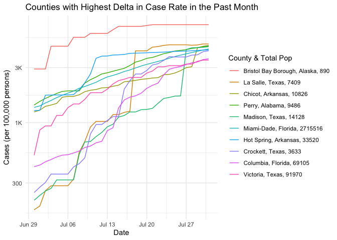
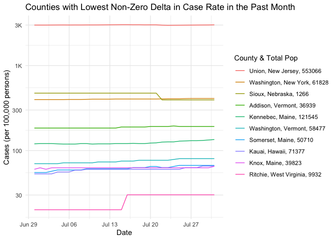
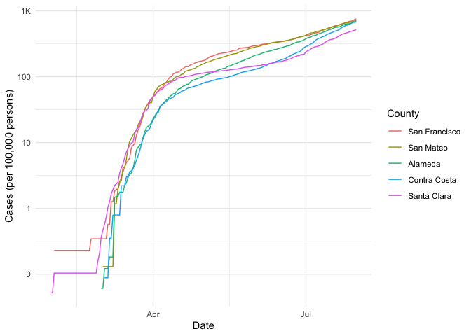

COVID-19
================
(Your name here)
2020-

  - [The Big Picture](#the-big-picture)
  - [Get the Data](#get-the-data)
      - [Navigating the Census Bureau](#navigating-the-census-bureau)
      - [Automated Download of NYT
        Data](#automated-download-of-nyt-data)
  - [Join the Data](#join-the-data)
  - [Analyze](#analyze)
      - [Normalize](#normalize)
      - [Guided EDA](#guided-eda)
      - [Self-directed EDA](#self-directed-eda)
          - [Ideas](#ideas)
          - [Aside: Some visualization
            tricks](#aside-some-visualization-tricks)
          - [Geographic exceptions](#geographic-exceptions)
  - [Notes](#notes)

*Purpose*: We can’t *possibly* do a class on data science and *not* look
at covid-19. Come on.

In this challenge, you’ll learn how to navigate the U.S. Census Bureau
website, programmatically download data from the internet, and perform a
county-level population-weighted analysis of current covid-19 trends.
Get excited\!

``` r
library(tidyverse)
```

    ## ── Attaching packages ───────────────────────────────────────── tidyverse 1.3.0 ──

    ## ✓ ggplot2 3.3.2     ✓ purrr   0.3.4
    ## ✓ tibble  3.0.1     ✓ dplyr   1.0.0
    ## ✓ tidyr   1.1.0     ✓ stringr 1.4.0
    ## ✓ readr   1.3.1     ✓ forcats 0.5.0

    ## ── Conflicts ──────────────────────────────────────────── tidyverse_conflicts() ──
    ## x dplyr::filter() masks stats::filter()
    ## x dplyr::lag()    masks stats::lag()

*Background*:
[COVID-19](https://en.wikipedia.org/wiki/Coronavirus_disease_2019) is
the disease caused by the virus SARS-CoV-2. In 2020 it became a global
pandemic, leading to huge loss of life and tremendous disruption to
society. The New York Times published up-to-date data on the progression
of the pandemic across the United States—we will study these data in
this challenge.

# The Big Picture

<!-- -------------------------------------------------- -->

We’re about to go through *a lot* of weird steps, so let’s first fix the
big picture firmly in mind:

We want to study COVID-19 in terms of data: both case counts (number of
infections) and deaths. We’re going to do a county-level analysis in
order to get a high-resolution view of the pandemic. Since US counties
can vary widely in terms of their population, we’ll need population
estimates in order to compute infection rates (think back to the
`Titanic` challenge).

That’s the high-level view; now let’s dig into the details.

# Get the Data

<!-- -------------------------------------------------- -->

1.  County-level population estimates (Census Bureau)
2.  County-level COVID-19 counts (New York Times)

## Navigating the Census Bureau

<!-- ------------------------- -->

**Steps**: Our objective is to find the 2018 American Community
Survey\[1\] (ACS) Total Population estimates, disaggregated by counties.
To check your results, this is Table `B01003`.

1.  Go to [data.census.gov](data.census.gov).
2.  Scroll down and click `View Tables`.
3.  Apply filters to find the ACS Total Population estimates,
    disaggregated by counties. I used the filters:

<!-- end list -->

  - `Topics > Populations and People > Counts, Estimates, and
    Projections > Population Total`
  - `Geography > County > All counties in United States`

<!-- end list -->

5.  Click the `Download` button to download the data; make sure to
    select the 2018 5-year estimates.
6.  Unzip and move the data to your `challenges/data` folder.

<!-- end list -->

  - Note that the data will have the crazy-long filename
    `ACSDT5Y2018.B01003_data_with_overlays_2020-06-30T102151.csv`.
    That’s because metadata is stored in the filename, such as the
    year of the estimate (`Y2018`) and my access date (`2020-06-30`).

**q1** Load Table `B01003` into the following tibble. Make sure the
column names are `id, Geographic Area Name, Estimate!!Total, Margin of
Error!!Total`.

*Hint*: You will need to use the `skip` keyword when loading these
data\!

``` r
## TASK: Load the census bureau data with the following tibble name.
filename_pop <- "./data/ACSDT5Y2018.B01003_data_with_overlays_2020-08-01T010758.csv"

## Load the data
df_pop <- read_csv(filename_pop, skip=1)
```

    ## Parsed with column specification:
    ## cols(
    ##   id = col_character(),
    ##   `Geographic Area Name` = col_character(),
    ##   `Estimate!!Total` = col_double(),
    ##   `Margin of Error!!Total` = col_character()
    ## )

``` r
glimpse(df_pop)
```

    ## Rows: 3,221
    ## Columns: 4
    ## $ id                       <chr> "0500000US01001", "0500000US01003", "0500000…
    ## $ `Geographic Area Name`   <chr> "Autauga County, Alabama", "Baldwin County, …
    ## $ `Estimate!!Total`        <dbl> 55200, 208107, 25782, 22527, 57645, 10352, 2…
    ## $ `Margin of Error!!Total` <chr> "*****", "*****", "*****", "*****", "*****",…

*Note*: You can find information on 1-year, 3-year, and 5-year estimates
[here](https://www.census.gov/programs-surveys/acs/guidance/estimates.html).
The punchline is that 5-year estimates are more reliable but less
current.

## Automated Download of NYT Data

<!-- ------------------------- -->

ACS 5-year estimates don’t change all that often, but the COVID-19 data
are changing rapidly. To that end, it would be nice to be able to
*programmatically* download the most recent data for analysis; that way
we can update our analysis whenever we want simply by re-running our
notebook. This next problem will have you set up such a pipeline.

The New York Times is publishing up-to-date data on COVID-19 on
[GitHub](https://github.com/nytimes/covid-19-data).

**q2** Visit the NYT [GitHub](https://github.com/nytimes/covid-19-data)
repo and find the URL for the **raw** US County-level data. Assign that
URL as a string to the variable below.

``` r
## TASK: Find the URL for the NYT covid-19 county-level data
url_counties <- "https://raw.githubusercontent.com/nytimes/covid-19-data/master/us-counties.csv"
```

Once you have the url, the following code will download a local copy of
the data, then load the data into R.

``` r
## NOTE: No need to change this; just execute
## Set the filename of the data to download
filename_nyt <- "./data/nyt_counties.csv"

## Download the data locally
curl::curl_download(
        url_counties,
        destfile = filename_nyt
      )

## Loads the downloaded csv
df_covid <- read_csv(filename_nyt)
```

    ## Parsed with column specification:
    ## cols(
    ##   date = col_date(format = ""),
    ##   county = col_character(),
    ##   state = col_character(),
    ##   fips = col_character(),
    ##   cases = col_double(),
    ##   deaths = col_double()
    ## )

You can now re-run the chunk above (or the entire notebook) to pull the
most recent version of the data. Thus you can periodically re-run this
notebook to check in on the pandemic as it evolves.

*Note*: You should feel free to copy-paste the code above for your own
future projects\!

# Join the Data

<!-- -------------------------------------------------- -->

To get a sense of our task, let’s take a glimpse at our two data
sources.

``` r
## NOTE: No need to change this; just execute
df_pop %>% glimpse
```

    ## Rows: 3,221
    ## Columns: 4
    ## $ id                       <chr> "0500000US01001", "0500000US01003", "0500000…
    ## $ `Geographic Area Name`   <chr> "Autauga County, Alabama", "Baldwin County, …
    ## $ `Estimate!!Total`        <dbl> 55200, 208107, 25782, 22527, 57645, 10352, 2…
    ## $ `Margin of Error!!Total` <chr> "*****", "*****", "*****", "*****", "*****",…

``` r
df_covid %>% glimpse
```

    ## Rows: 389,202
    ## Columns: 6
    ## $ date   <date> 2020-01-21, 2020-01-22, 2020-01-23, 2020-01-24, 2020-01-24, 2…
    ## $ county <chr> "Snohomish", "Snohomish", "Snohomish", "Cook", "Snohomish", "O…
    ## $ state  <chr> "Washington", "Washington", "Washington", "Illinois", "Washing…
    ## $ fips   <chr> "53061", "53061", "53061", "17031", "53061", "06059", "17031",…
    ## $ cases  <dbl> 1, 1, 1, 1, 1, 1, 1, 1, 1, 1, 1, 1, 1, 1, 1, 1, 1, 1, 1, 1, 1,…
    ## $ deaths <dbl> 0, 0, 0, 0, 0, 0, 0, 0, 0, 0, 0, 0, 0, 0, 0, 0, 0, 0, 0, 0, 0,…

To join these datasets, we’ll need to use [FIPS county
codes](https://en.wikipedia.org/wiki/FIPS_county_code).\[2\] The last
`5` digits of the `id` column in `df_pop` is the FIPS county code, while
the NYT data `df_covid` already contains the `fips`.

**q3** Process the `id` column of `df_pop` to create a `fips` column.

``` r
## TASK: Create a `fips` column by extracting the county code
df_q3 <- df_pop %>%
  mutate(fips = str_sub(id, start= -5))
```

Use the following test to check your answer.

``` r
## NOTE: No need to change this
## Check known county
assertthat::assert_that(
              (df_q3 %>%
              filter(str_detect(`Geographic Area Name`, "Autauga County")) %>%
              pull(fips)) == "01001"
            )
```

    ## [1] TRUE

``` r
print("Very good!")
```

    ## [1] "Very good!"

Once

**q4** Join `df_covid` with `df_q3` by the `fips` column. Use the proper
type of join to preserve all rows in `df_covid`.

``` r
## TASK: Join df_covid and df_q3 by fips.
df_q4 <- df_covid %>%
  left_join(
    df_q3,
    by = "fips"
  )
```

For convenience, I down-select some columns and produce more convenient
column names.

``` r
## NOTE: No need to change; run this to produce a more convenient tibble
df_data <-
  df_q4 %>%
  select(
    date,
    county,
    state,
    fips,
    cases,
    deaths,
    population = `Estimate!!Total`
  )
df_data
```

    ## # A tibble: 389,202 x 7
    ##    date       county      state      fips  cases deaths population
    ##    <date>     <chr>       <chr>      <chr> <dbl>  <dbl>      <dbl>
    ##  1 2020-01-21 Snohomish   Washington 53061     1      0     786620
    ##  2 2020-01-22 Snohomish   Washington 53061     1      0     786620
    ##  3 2020-01-23 Snohomish   Washington 53061     1      0     786620
    ##  4 2020-01-24 Cook        Illinois   17031     1      0    5223719
    ##  5 2020-01-24 Snohomish   Washington 53061     1      0     786620
    ##  6 2020-01-25 Orange      California 06059     1      0    3164182
    ##  7 2020-01-25 Cook        Illinois   17031     1      0    5223719
    ##  8 2020-01-25 Snohomish   Washington 53061     1      0     786620
    ##  9 2020-01-26 Maricopa    Arizona    04013     1      0    4253913
    ## 10 2020-01-26 Los Angeles California 06037     1      0   10098052
    ## # … with 389,192 more rows

# Analyze

<!-- -------------------------------------------------- -->

Now that we’ve done the hard work of loading and wrangling the data, we
can finally start our analysis. Our first step will be to produce county
population-normalized cases and death counts. Then we will explore the
data.

## Normalize

<!-- ------------------------- -->

**q5** Use the `population` estimates in `df_data` to normalize `cases`
and `deaths` to produce per 100,000 counts.\[3\] Store these values in
the columns `cases_perk` and `deaths_perk`.

``` r
## TASK: Normalize cases and deaths
df_normalized <-
  df_data %>%
  mutate(cases_perk = cases / (population/100000)) %>%
  mutate(deaths_perk = deaths / (population/1000000)) %>%
  mutate(county_state = paste(county, state, population, sep = ", "))
```

You may use the following test to check your work.

``` r
## NOTE: No need to change this
## Check known county data
assertthat::assert_that(
              abs(df_normalized %>%
               filter(
                 str_detect(county, "Snohomish"),
                 date == "2020-01-21"
               ) %>%
              pull(cases_perk) - 0.127) < 1e-3
            )
```

    ## [1] TRUE

``` r
assertthat::assert_that(
              abs(df_normalized %>%
               filter(
                 str_detect(county, "Snohomish"),
                 date == "2020-01-21"
               ) %>%
              pull(deaths_perk) - 0) < 1e-3
            )
```

    ## [1] TRUE

``` r
print("Excellent!")
```

    ## [1] "Excellent!"

## Guided EDA

<!-- ------------------------- -->

Before turning you loose, let’s complete a couple guided EDA tasks.

**q6** Compute the mean and standard deviation for `cases_perk` and
`deaths_perk`.

``` r
## TASK: Compute mean and sd for cases_perk and deaths_perk
cases_perk_mean <- mean(df_normalized$cases_perk, na.rm = TRUE)
deaths_perk_mean <- mean(df_normalized$deaths_perk, na.rm = TRUE)
cases_perk_stddev <- sd(df_normalized$cases_perk, na.rm = TRUE)
deaths_perk_stddev <- sd(df_normalized$deaths_perk, na.rm = TRUE)
```

**q7** Find the top 10 counties in terms of `cases_perk`, and the top 10
in terms of `deaths_perk`. Report the population of each county along
with the per-100,000 counts. Compare the counts against the mean values
you found in q6. Note any observations. Does New York City show up in
the top? Why or why not?

``` r
## TASK: Find the top 10 max cases_perk counties; report populations as well
q7_cases_perk <- df_normalized %>%
  filter(date == "2020-07-30") %>%
  arrange(desc(cases_perk))
## TASK: Find the top 10 deaths_perk counties; report populations as well
q7_deaths_perk <- df_normalized %>%
  filter(date == "2020-07-30") %>%
  arrange(desc(deaths_perk))
q7_cases_perk
```

    ## # A tibble: 3,218 x 10
    ##    date       county state fips  cases deaths population cases_perk deaths_perk
    ##    <date>     <chr>  <chr> <chr> <dbl>  <dbl>      <dbl>      <dbl>       <dbl>
    ##  1 2020-07-30 Trous… Tenn… 47169  1567      6       9573     16369.        627.
    ##  2 2020-07-30 Lake   Tenn… 47095   726      0       7526      9647.          0 
    ##  3 2020-07-30 Lee    Arka… 05077   879      6       9398      9353.        638.
    ##  4 2020-07-30 Dakota Nebr… 31043  1896     42      20317      9332.       2067.
    ##  5 2020-07-30 Buena… Iowa  19021  1782     12      20260      8796.        592.
    ##  6 2020-07-30 Linco… Arka… 05079  1161     11      13695      8478.        803.
    ##  7 2020-07-30 Nobles Minn… 27105  1737      6      21839      7954.        275.
    ##  8 2020-07-30 Brist… Alas… 02060    63      0        890      7079.          0 
    ##  9 2020-07-30 East … Loui… 22035   492      1       7225      6810.        138.
    ## 10 2020-07-30 Colfax Nebr… 31037   692      4      10760      6431.        372.
    ## # … with 3,208 more rows, and 1 more variable: county_state <chr>

``` r
q7_deaths_perk
```

    ## # A tibble: 3,218 x 10
    ##    date       county state fips  cases deaths population cases_perk deaths_perk
    ##    <date>     <chr>  <chr> <chr> <dbl>  <dbl>      <dbl>      <dbl>       <dbl>
    ##  1 2020-07-30 Hanco… Geor… 13141   280     34       8535      3281.       3984.
    ##  2 2020-07-30 Rando… Geor… 13243   246     26       7087      3471.       3669.
    ##  3 2020-07-30 Terre… Geor… 13273   288     29       8859      3251.       3274.
    ##  4 2020-07-30 McKin… New … 35031  3977    219      72849      5459.       3006.
    ##  5 2020-07-30 Early  Geor… 13099   339     31      10348      3276.       2996.
    ##  6 2020-07-30 Nesho… Miss… 28099  1167     85      29376      3973.       2894.
    ##  7 2020-07-30 Empor… Virg… 51595   163     15       5381      3029.       2788.
    ##  8 2020-07-30 Essex  New … 34013 19684   2100     793555      2480.       2646.
    ##  9 2020-07-30 Galax… Virg… 51640   329     17       6638      4956.       2561.
    ## 10 2020-07-30 Lownd… Alab… 01085   559     26      10236      5461.       2540.
    ## # … with 3,208 more rows, and 1 more variable: county_state <chr>

**Observations**:

  - \[Note\] I filtered by the most recent date available to be able to
    compare across different counties uniquely - it seems like this
    should be pretty complete in terms of number of counties based on
    the row count.
  - Counties with the highest case rates are not all in the same area,
    but Tennessee, Arkansas, and Nebraska each have two counties in the
    top ten.
  - The counties with the highest case rates do not have particularly
    high case numbers in total, just high relative to their populations.
  - In the county with the highest case rate, over 16% of the population
    has COVID-19. That’s pretty wild.
  - Counties with the highest death rates (per population, not per
    infection rate) seem less spread out - Georgia is very
    overrepresented. However even in the counties with the highest death
    rates, the death counts are quite low, so an outbreak in a clustered
    vulnerable population (say, a nursing home) would be likely to cause
    the county level effect on its own (still bad).
  - Overall county populations among the top ten death rates appear
    higher than those in the top ten case rates - maybe also somewhat
    tied to the small death counts in total, but also potentially could
    be reporting bias as people who are very sick might be moved to a
    higher-population county for more intensive treatment, causing
    deaths to be reported in different counties from where the patients
    reside?
  - Interesting that there does not appear to be high overlap in areas
    with the highest case rates also having the highest death rates (at
    least among the top ten of each).
  - Compared to the means of both, the highest values are way higher -
    this is generally consistent with the high stddev values we see.
    Presumably there are many counties with very low or zero counts in
    both, or with missing data.
  - New York does not show up in the top - apparently there are high
    counts of cases and deaths there but not proportionally more than
    many counties in other places. \[Edit - reading the note below I see
    also this data is missing due to FIPS code ;)\]

## Self-directed EDA

<!-- ------------------------- -->

**q8** Drive your own ship: You’ve just put together a very rich
dataset; you now get to explore\! Pick your own direction and generate
at least one punchline figure to document an interesting finding. I give
a couple tips & ideas below:

``` r
## Question: Who is handling it best (and worst)? Any counties with non-trivial case rates (above 100 per 100,000) but decline in case numbers over the past month? 

q8_cases_latest <- df_normalized %>%
  filter(date == "2020-07-30")

q8_cases_one_month_ago <- df_normalized %>%
  filter(date == "2020-06-30")

q8_cases_delta <- q8_cases_latest %>%
  left_join(q8_cases_one_month_ago, by = "fips") %>%
  mutate(one_month_delta = cases_perk.x - cases_perk.y) %>%
  arrange(one_month_delta)

q8_cases_highest_delta <- q8_cases_delta %>%
  top_n(10, one_month_delta) %>%
  pull(fips)
  
q8_cases_lowest_delta <- q8_cases_delta %>%
  filter(one_month_delta != 0) %>%
  top_n(-10, one_month_delta) %>%
  pull(fips)

df_normalized %>%
  filter(fips %in% q8_cases_highest_delta) %>%
  filter(date >= "2020-06-30") %>%

  ggplot(
    aes(date, cases_perk, color = fct_reorder2(county_state, date, cases_perk))
  ) +
  geom_line() +
  scale_y_log10(labels = scales::label_number_si()) +
  scale_color_discrete(name = "County & Total Pop") +
  theme_minimal() +
  labs(
    x = "Date",
    y = "Cases (per 100,000 persons)"
  ) +
  ggtitle("Counties with Highest Delta in Case Rate in the Past Month")
```

<!-- -->

**Observations**:

  - Very rough derivative suggesting rate of increase in cases based on
    the difference in cases per 100,000 between June 30 to July 30.
  - Interesting that many counties with the highest case rate increase
    over the past month have ended up with the latest rates around a
    similar value of 3000 cases per 100,000 people.
  - Fairly wide spread of total population among the counties with
    highest case rate increase, one very small and one very large but
    mostly medium-sized counties.
  - Since we’re looking at cases per 100,000, we do see some large jumps
    that probably reflect very small raw numbers of cases increasing in
    some smaller counties.
  - Overall pretty scary that in these areas with the fastest-growing
    case rates, they are currently seeing around 3% of the population
    infected (if I’m reading this right) which suggests that rapid
    increase might be likely to continue there through community spread.
  - I shamelessly employed the plotting tips ZDR shared below to order
    the counties to match the graph. It’s still kinda hard to visually
    differentiate between ten colors though.

<!-- end list -->

``` r
df_normalized %>%
  filter(fips %in% q8_cases_lowest_delta) %>%
  filter(date >= "2020-06-30") %>%

  ggplot(
    aes(date, cases_perk, color = fct_reorder2(county_state, date, cases_perk))
  ) +
  geom_line() +
  scale_y_log10(labels = scales::label_number_si()) +
  scale_color_discrete(name = "County & Total Pop") +
  theme_minimal() +
  labs(
    x = "Date",
    y = "Cases (per 100,000 persons)"
  ) +
  ggtitle("Counties with Lowest Non-Zero Delta in Case Rate in the Past Month")
```

<!-- -->

**Observations**:

  - \[Note\] I stripped out the zero-change data points to get a clearer
    picture, and since those data seem a bit less likely to be useful
    whether by being very small numbers or by being missing data leading
    to the same case rate reported at both dates.
  - There is one county in the data set that showed a decline in case
    rate over the past month (yay\!) although it is very small and in a
    small county.
  - For the most part, it appears the best possible outcome is a steady
    case rate or slight increase over time. This does prompt the
    question whether recoveries are subtracted from the case numbers -
    from the local reporting I have seen usually they are, so this might
    suggest either people tend to be slow to recover and generally stay
    in the active case number for a long time, or that new people are
    getting sick but not faster than others are recovering.
  - Fairly wide spread of county population size in this group of
    counties as well.
  - Union seems actually somewhat hopeful, suggesting (if we trust the
    data reported) that even in a fairly large county with a quite high
    case rate, it is possible to stabilize and not allow rapid increase
    in the number of cases in the county.
  - In comparison to the plot above of the fastest-growing counties, it
    could be worth looking at what these counties are doing to contain
    the spread.

### Ideas

<!-- ------------------------- -->

  - Look for outliers.
  - Try web searching for news stories in some of the outlier counties.
  - Investigate relationships between county population and counts.
  - Fix the *geographic exceptions* noted below to study New York City.
  - Your own idea\!

### Aside: Some visualization tricks

<!-- ------------------------- -->

These data get a little busy, so it’s helpful to know a few `ggplot`
tricks to help with the visualization. Here’s an example focused on the
Bay Area

``` r
## NOTE: No need to change this; just an example
df_normalized %>%
  filter(county %in% c("Santa Clara","San Mateo","San Francisco","Alameda","Contra Costa")) %>%

  ggplot(
    aes(date, cases_perk, color = fct_reorder2(county, date, cases_perk))
  ) +
  geom_line() +
  scale_y_log10(labels = scales::label_number_si()) +
  scale_color_discrete(name = "County") +
  theme_minimal() +
  labs(
    x = "Date",
    y = "Cases (per 100,000 persons)"
  )
```

<!-- -->

*Tricks*:

  - I use `fct_reorder2` to *re-order* the color labels such that the
    color in the legend on the right is ordered the same as the vertical
    order of rightmost points on the curves. This makes it easier to
    reference the legend.
  - I manually set the `name` of the color scale in order to avoid
    reporting the `fct_reorder2` call.
  - I use `scales::label_number_si` to make the vertical labels more
    readable.
  - I use `theme_minimal()` to clean up the theme a bit.
  - I use `labs()` to give manual labels.

### Geographic exceptions

<!-- ------------------------- -->

The NYT repo documents some [geographic
exceptions](https://github.com/nytimes/covid-19-data#geographic-exceptions);
the data for New York, Kings, Queens, Bronx and Richmond counties are
consolidated under “New York City” *without* a fips code. Thus the
normalized counts in `df_normalized` are `NA`. To fix this, you would
need to merge the population data from the New York City counties, and
manually normalize the data.

# Notes

<!-- -------------------------------------------------- -->

\[1\] The census used to have many, many questions, but the ACS was
created in 2010 to remove some questions and shorten the census. You can
learn more in [this wonderful visual
history](https://pudding.cool/2020/03/census-history/) of the census.

\[2\] FIPS stands for [Federal Information Processing
Standards](https://en.wikipedia.org/wiki/Federal_Information_Processing_Standards);
these are computer standards issued by NIST for things such as
government data.

\[3\] Demographers often report statistics not in percentages (per 100
people), but rather in per 100,000 persons. This is [not always the
case](https://stats.stackexchange.com/questions/12810/why-do-demographers-give-rates-per-100-000-people)
though\!
